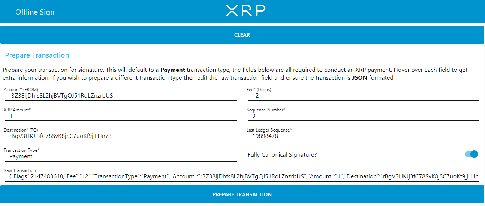
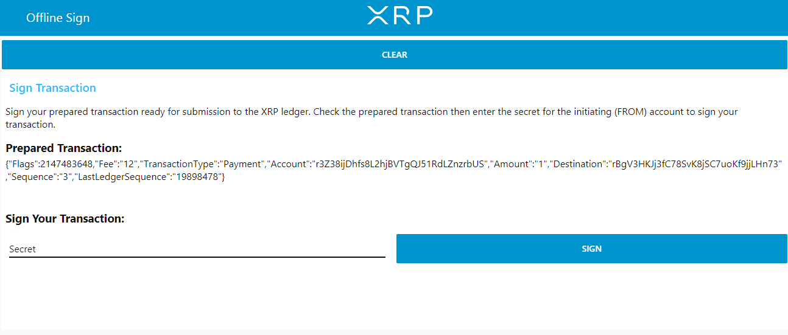
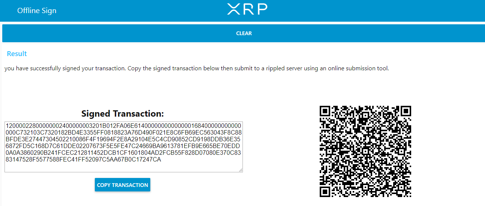
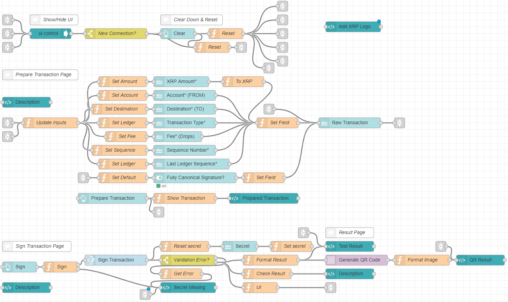

<h4 align="center">  
  
   
Redefining the future one integration at a time  
</h4>  

<h3 align="center">  
<a href="Offline%20Sign%20Tool.json" target="_blank">Offline Sign Tool</a>
</h3>  

Why not create your own XRP Ledger offline sign tool?

Node-Red can be installed on pretty much any device, have an old laptop or even a raspberry pi lying around? Then get node-red installed and install an offline sign tool to secure your transactions!

#### This flow will allow you to:  
- Prepare a transaction for signing
- Sign a prepared transaction
- View the result in both text form and QR format
- Customise to your own liking
- Get an idea of how simple and easy this is

#### Prerequisites
- Node-RED
- <a href="Offline%20Sign%20Tool.json" target="_blank">This flow</a>
- <a href="https://flows.nodered.org/node/node-red-dashboard">The node-red-dashboard package</a>

Once you have your signed transaction you can then copy this to an online submission tool connected to a rippled server to be published to the XRP Ledger. Even better why not build your own using these nodes??

This flow is an example of the different types of flows which can be created. Please test your flows on the testnet before trying with the livenet.

Feel free to ask any questions.

### Screenshots

### Prepare Payment Transaction

### Sign The Transaction

### View The Result

### The flow

