## Quick Examples of Flows

The below images show the different uses of the XRP nodes. These are meant to demonstrate visually how easy it is to put a flow together to build something of value. You don't need to be a programmer or designer, it really is that easy.

Tutorials and video demonstrations are coming this way!!

A brief rundown of the quick examples:
- <a href="#xrpl-palette-and-debugging">XRPL Palette</a> A clean and simple palette makes creating your own apps a breeze.
- <a href="#create-new-account">Create New Account</a> Generate a new XRP address with a secret key.
- <a href="#get-transactions">Get Transactions</a> Pull and view transactions for any XRP address.
- <a href="#subscribe-to-transactions">Subscribe to Transactions</a> Keeps tabs when transactions are received.
- <a href="#regular-payments">Regular Payments</a> Setup regular payments using any schedule.
- <a href="#create-transactions">Create Transactions</a> Create and compose different types of XRP transactions.
- <a href="#create-escrow">Create Escrow</a> Create escrows programmatically with ease.
- <a href="#custom-wallet">Custom Wallet</a> Build your own custom wallet like no other!
- <a href="#monitor-hot-cold-wallets">Monitor Wallets</a> Automatically move XRP around between wallets.
- <a href="#dashboard-tools">Dashboard Tools</a> Build custom dashboard interfaces.
- <a href="#point-of-sale">Point of Sale</a> Create your own point of sale system.

## XRPL Palette and Debugging
Creating your own flows is as simple as dragging and dropping XRPL nodes onto your workspace. There is a help description contained within the description of the node on the right hand side if you get stuck with links back to the original Ripple Library of code developed by Ripple themselves.

Node-red also offers a powerful debug system allowing you to quickly see what's going on where. Drag and drop debug nodes into your workspace and connect them to your nodes to see what's going on at what stage.

The debug image shows three examples, the first generating a new XRP account with a secret. The second showing the information of a particular account. And lastly the outcome of an XRP payment.

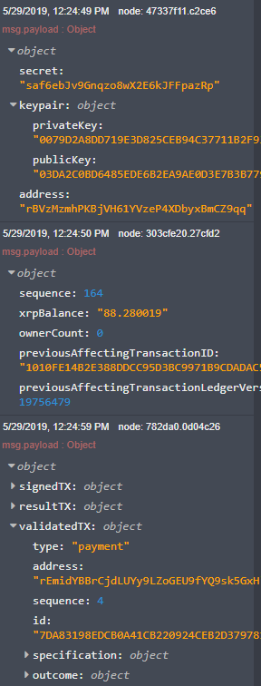
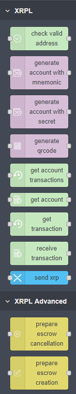

## Create New Account
This little flow demonstrates how to generate an XRP account derived from a secret. You can also generate an account from a mnemonic, in this case a 24 word one. Try it out.

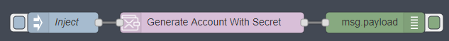

## Get Transactions
This flow shows how easy it is to get a list of account transactions. Just simply populate the XRP address and choose live or test net with the <b>Get Account Transactions</b> node and your good to go.

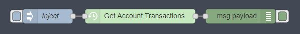

## Subscribe To Transactions
You can even subscribe to XRP accounts to be notified as soon as a transaction is received! The little function in the middle takes the message and formats it so that Alexa can speak it!

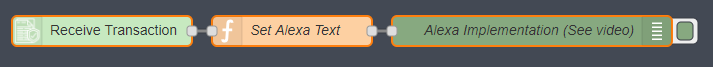

## Regular Payments
Who wants regular payments? We do!! These two little nodes show how little effort is involved to setup regular XRP payments.

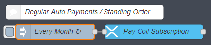

## Create Transactions
Transactions can be created for all the many different types the XRP ledger has available. Check out <a href="https://developers.ripple.com/rippleapi-reference.html">Ripples API guides</a>. More nodes are coming soon to further simplify this!

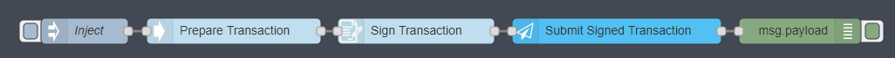

#### Assign Regular Key Transaction
Want to assign another key to your XRP account or even disable your master key? It's as easy as pie yum yum.

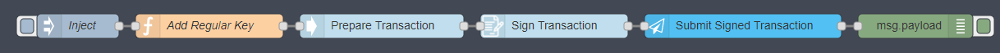

## Create Escrow
This flow shows how an escrow can be created, additional nodes are used to execute or cancel an escrow. A bigger better write up will follow.

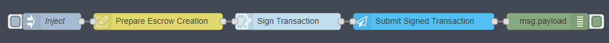

## Custom Wallet
Creating your own custom XRP wallets is such a doddle. Using the node-red UI dashboard you can simply drag and drop the elements into your flow and have a working wallet in no time.

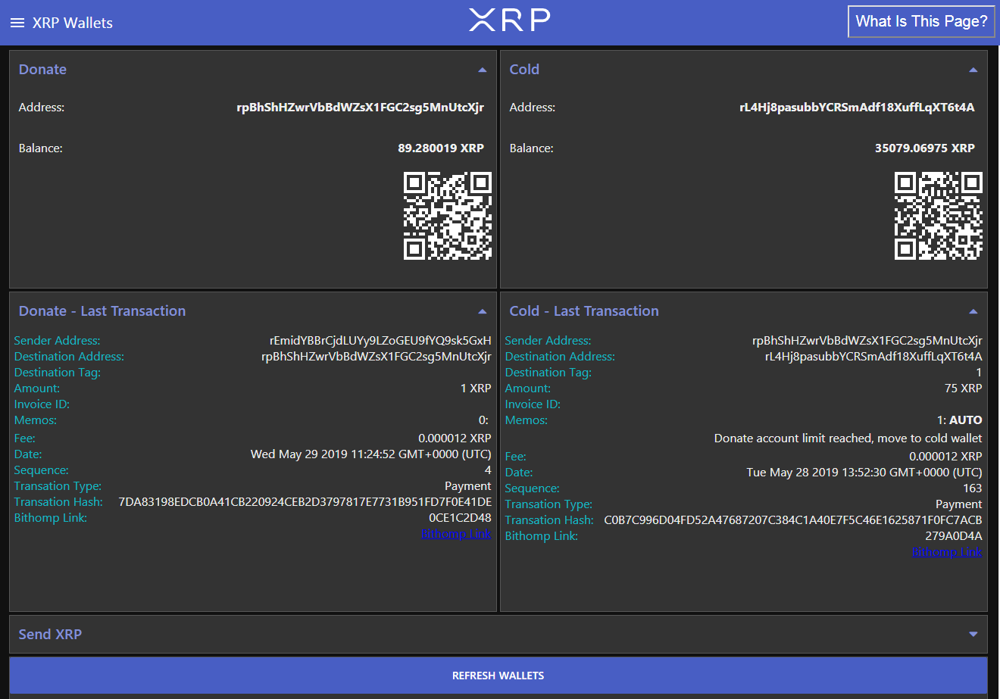
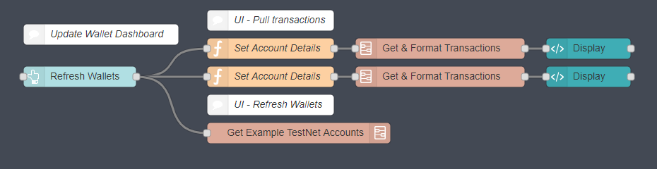

## Monitor Hot Cold Wallets
These set of flows demonstrates how a hot wallet (donation in this case) can be monitored for transactions and in the event the wallet exceeds 100XRP, the wallet is reduced back down to 50XRP with the excess being transferred over to a cold wallet. All whilst keeping us informed of the situation via Alexa and Telegram, isn't that kind?

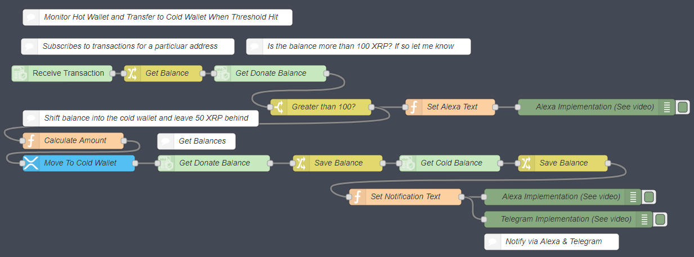

## Dashboard Tools
Create and define your own set of tools to use, whether its price tracking, payment volume etc. Be creative and share your results!

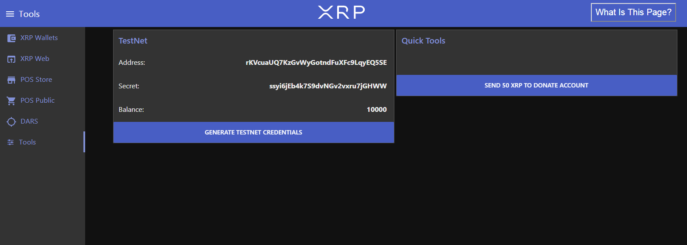

## Point Of Sale
These next screenshots show a simple Point Of Sale System which is capable of taking payment via XRP. The flow calculates the total then generates a QR code with the required information. The flow also monitors the wallet for incoming matching payments.

#### Store

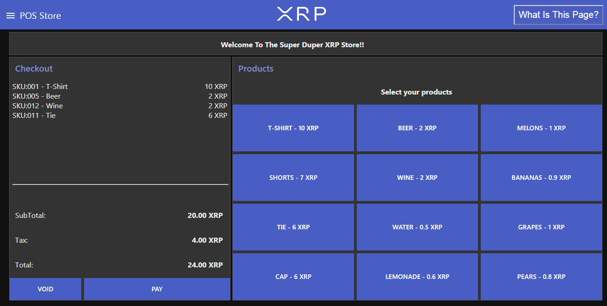
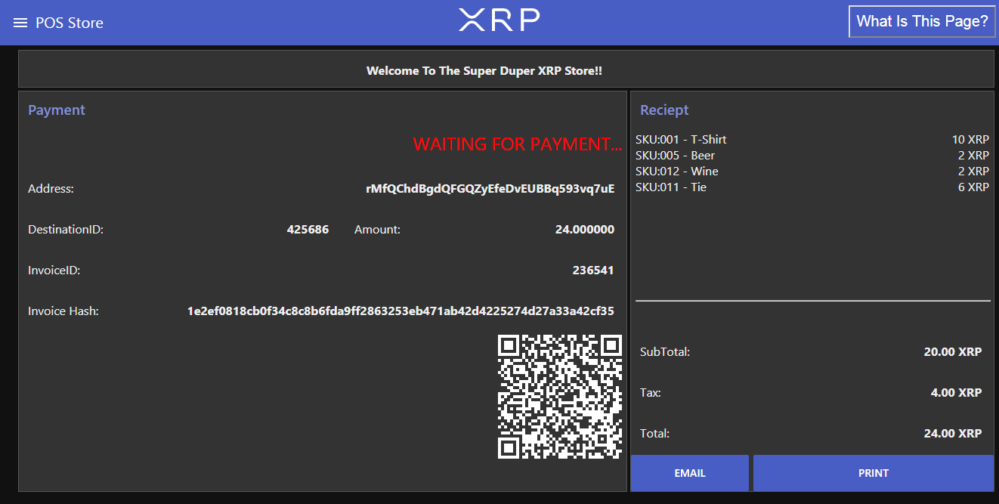

#### Customer Facing Screen

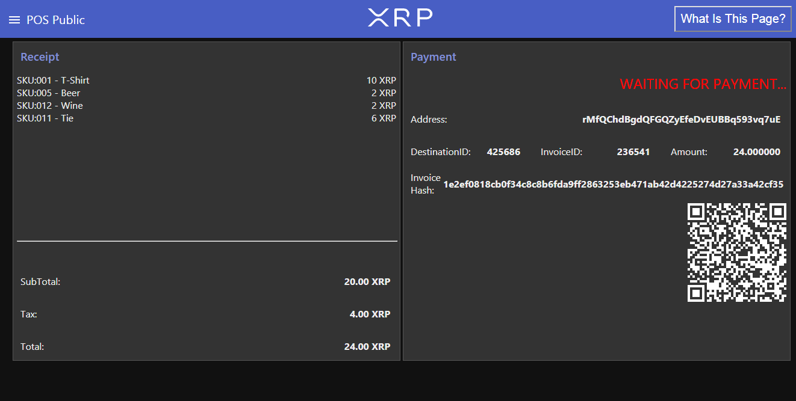
